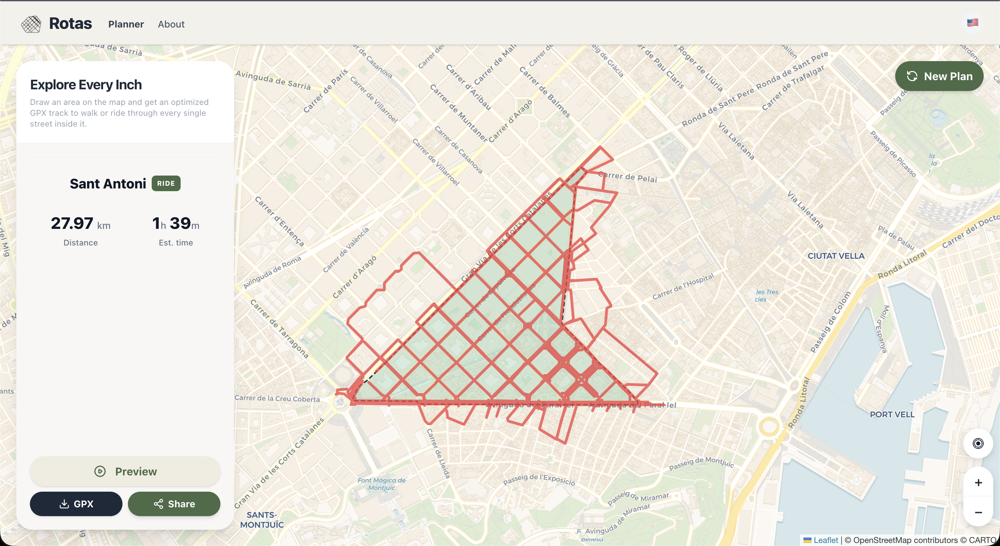

<div align="center">
  

  <h1>Rotas</h1>
  <p><strong>Explore Every Inch.</strong></p>
  <p>Draw any area on the map and get a perfectly optimised GPX track that covers every single street inside it — ready to ride or run.</p>

  
  
  
  
  
</div>

---



---

## What is Rotas?

**Rotas** solves the classic "explore every street" problem. Draw a polygon over any neighbourhood, click **Generate**, and the app returns the shortest possible route that covers every road segment inside your area — no street skipped, no unnecessary backtracking.

It's built for runners, cyclists, and anyone who wants to systematically explore a city block by block.

---

## Features

| Feature | Description |
|---|---|
| 🖊️ **Draw or Pick** | Freehand polygon drawing *or* one-click neighbourhood picker powered by OSM administrative boundaries |
| 🧮 **Eulerian Optimisation** | Solves the [Mixed Chinese Postman Problem](https://en.wikipedia.org/wiki/Route_inspection_problem) to find the shortest path through every edge |
| 🚴 **Sport Modes** | Cycling and Walking, each with accurate speed/pace estimates |
| 🗺️ **Animated Preview** | Watch the route animate step-by-step directly on the map |
| 📤 **GPX Export** | One-click export compatible with Garmin, Wahoo, Komoot, Strava, etc. |
| 🔗 **Share via URL** | Compressed, shareable links that reconstruct the full route in any browser |
| 🌍 **i18n** | Full localisation in English, Portuguese (pt-BR) and Spanish (es-ES) with automatic browser language detection |
| ⚡ **PWA** | Installable, offline-capable Progressive Web App |
| 🔒 **Safety Preference** | Cyclists can restrict the query to safer roads or dedicated cycling infrastructure |
| 📏 **Buffer Expansion** | Configurable polygon expansion (0–100 m) to capture streets at the boundary |

---

## How it works

```
User draws polygon
       │
       ▼
Overpass API (via Cloudflare Worker proxy)
  fetches OSM road network
       │
       ▼
Web Worker  ──► Tarjan SCC (iterative)     builds connected graph
            ──► MCPP / LP Solver           finds minimum deadheading
            ──► Hierholzer's Algorithm     constructs Eulerian circuit
       │
       ▼
React UI renders polyline + sidebar stats
```

- **All heavy computation runs in a Web Worker** so the UI stays responsive during processing.
- The LP Solver falls back to a **greedy Dijkstra heuristic** for graphs > 1 000 edges to prevent out-of-memory crashes on large neighbourhoods.
- Shared URLs use `@mapbox/polyline` + `lz-string` compression to keep links short enough to avoid HTTP 431 errors.

---

## Technology Stack

### Frontend
| Library | Role |
|---|---|
| **React 19** | Component UI |
| **TypeScript 6** | Type safety (`strict: true`) |
| **Vite 8** | Build tool & dev server |
| **TailwindCSS 4** | Styling |
| **Zustand** | Global state (sport mode, preferences) |
| **TanStack Router** | File-based routing with Zod-validated search params |
| **TanStack Query** | Network layer for Overpass API calls |
| **react-i18next** | Internationalisation |

### Map & Geo
| Library | Role |
|---|---|
| **Leaflet** | Interactive map |
| **leaflet-draw** | Polygon drawing tools |
| **OpenStreetMap / Overpass API** | Road network data |
| **osmtogeojson** | Converts OSM relations to GeoJSON |
| **@mapbox/polyline** | GPS path encoding |
| **lz-string** | URL compression |

### Algorithms
| Algorithm | Purpose |
|---|---|
| **Tarjan SCC** (iterative) | Finds the largest connected component |
| **Mixed Chinese Postman / LP Solver** | Minimises edge repetition |
| **Dijkstra heuristic** | OOM-safe fallback for large graphs |
| **Hierholzer's** | Builds the final Eulerian circuit |

### Infrastructure
| Tool | Role |
|---|---|
| **Supabase Edge Functions** | Stateless API and OAuth handling |
| **Supabase Postgres + pgmq** | Durable background task queues for heavy Strava synchronisation |
| **Cloudflare Worker** | CORS proxy + multi-endpoint fallback for Overpass (`rotas-overpass-proxy`) |
| **Vercel** | Frontend Hosting |
| **Playwright** | E2E tests + visual regression |
| **Vitest** | Unit tests |
| **vite-plugin-pwa / Workbox** | Service worker & offline support |

---

## Project Structure

```
src/
├── api/           # Network layer (Overpass queries via TanStack Query)
├── components/    # Reusable UI components
│   ├── ui/        # Button primitives
│   └── icons/     # Centralised SVG icon library
├── i18n/
│   └── locales/   # en-US.json · pt-BR.json · es-ES.json
├── pages/         # Planner.tsx · Preview.tsx (shared route view)
├── store/         # Zustand global store
├── utils/         # Pure utility functions (gpxExport, routeSharing)
└── workers/       # optimizer.worker.ts (runs off-main-thread)
```

---

## Getting Started

### Prerequisites
- Node.js ≥ 18
- pnpm ≥ 11
- **Docker Desktop** (required for local Supabase)
- **Supabase CLI** (installed automatically via npx)

### Environment Setup

Rotas requires a Strava API application to handle user authentication and route synchronization. To bring your own Strava API key:

1. Log in to your Strava account and go to the [API Settings page](https://www.strava.com/settings/api).
2. Create a new API Application.
3. Set the **Authorization Callback Domain** to `localhost` (for local development) or your production domain.
4. Locate your **Client ID** and **Client Secret**.

Create a `.env` file in the `supabase/` directory and populate it with your Strava API credentials:

```bash
STRAVA_CLIENT_ID="your_strava_client_id"
STRAVA_CLIENT_SECRET="your_strava_client_secret"
STRAVA_REDIRECT_URI="http://localhost:5173/auth/callback"
```

### Local Development

```bash
# 1. Clone the repo
git clone https://github.com/icaromh/rotas.git
cd rotas

# 2. Install dependencies
pnpm install

# 3. Start local Supabase (Database, Auth, Edge Functions & Queues)
# Note: Ensure Docker is running before executing this
npx supabase start

# 4. Apply database migrations (including pgmq extension for queues)
pnpm run db:push

# 5. Start the Vite dev server
pnpm run dev
```

Open [http://localhost:5173](http://localhost:5173) in your browser.

> **Note on Edge Functions:** The API and background queues (like Strava sync) run on Supabase Edge Functions. The local Supabase stack automatically serves these at `http://127.0.0.1:54321/functions/v1/`, and Vite automatically proxies `/api` requests to them.

### Troubleshooting Local Database
If your local background queues (pgmq) get stuck or you experience permission denied errors on local tables after writing new migrations, resetting the local database will often clear out the stale state and re-apply all roles/triggers:
```bash
npx supabase db reset
```

### Other scripts

```bash
pnpm run build             # Production build (TypeScript + Vite)
pnpm test                  # Unit tests (Vitest)
pnpm run test:e2e          # E2E flow tests (Playwright)
pnpm run test:e2e:visual   # Visual regression tests
pnpm run deploy:proxy      # Deploy the Cloudflare Worker proxy
pnpm run deploy:functions  # Deploy Supabase Edge Functions to production
```

---

## Contributing

Pull requests are welcome! For major changes, please open an issue first to discuss what you would like to change.

1. Fork the repo and create a feature branch (`git checkout -b feat/my-feature`)
2. Follow the existing code style and run `pnpm test` before submitting
3. Keep string literals out of components — use `react-i18next` keys and update all three locale files (`en-US`, `pt-BR`, `es-ES`)
4. Update `CHANGELOG.md` with a summary of your changes

---

## Acknowledgements

- [OpenStreetMap](https://www.openstreetmap.org/) contributors for the map data
- [Leaflet](https://leafletjs.com/) for the fantastic mapping library
- [Overpass API](https://overpass-api.de/) for the road network queries
- [javascript-lp-solver](https://github.com/JWally/jsLPSolver) for the linear programming engine

---

<div align="center">
  Made with ❤️ by <a href="https://github.com/icaromh">Icaro MH</a>
</div>
